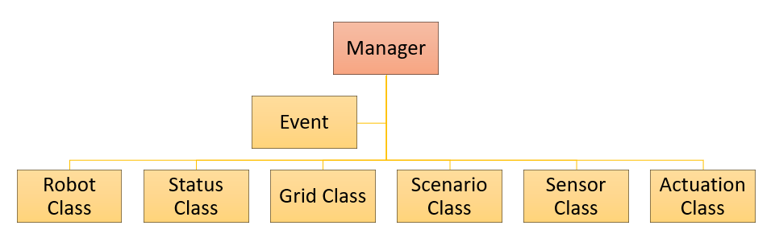

# Basic Structure of Software

Basicly a *Manager* and *GUI* will be designed. *Manager* will be designed to keep the track of the robots and the scenario. Moreover,
 the subclasses will be codded into the *Manager* in order to prevent the possible slowdown issues with the *GUI*. 
 Very first prototypical design of the *Manager* is given in the following chart.
 
 ###### Basic Prototypical Design of the *Manager*

Manager includes:

* **Event:** Event is a function, which will actuate the robots accordingly to the scenario and situations.
* **Robot Class:** A class, which includes the main robot types.
* **Status Class:** A class, which includes the main status effects. Status effects may be triggered randomly according to 
the scenarios, or the can be triggered by the actuations.
* **Grid Class:** A class, which includes the main grid types. Grid types are the fundamental parts of the arena, 
and they can be adjusted according to the scenario.
* **Scenario Class:** A class, which includes the scenarios. 
Scenarios are the indicators of the which kind of actions will be performed in the arena.
* **Sensor Class:** A class, which includes the main sensor types. Sensors will limit or increase the abilities of robots.
* **Actuation Class:** A class, which includes the main actuation types. 
Actuations are the incidents that will effect the statuses of the robots or the arena.

Manager will communicate with *Normal User* or *Administrator* through *GUI*. A basic design of the process flow is given in the
following chart. 

 ###### Basic Prototypical Design of the Process Flow

The process arrows have specific colors, which demonstrate a the meaning of the process. The meanings of the arrow colors are given
at the right bottom of the chart. **Green Arrows** demonstrate an information flow between subjects, 
**Red Arrows** demonstrate an order flow between subjects, **Yellow Arrows** demonstrate an demand flow between subjects, and 
**Grey Arrows** demonstrate an effect between subjects. 

Demands will be in progress if there were no restrictions aganist that demand. Orders will be in progress no matter what and only can
be given by the *Administrator*.
